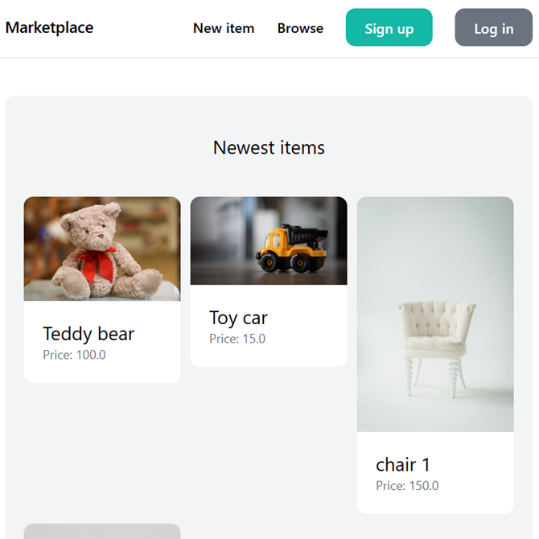

# Marketplace Application

Marketplace is a Django-based web application that allows users to list items for sale, browse categories, and engage in conversations related to items. It features user authentication, item management, messaging, and a dashboard to track user listings.

---

## Features

- **User Authentication**: Signup, login, and logout with username and email.
- **Item Listings**: Users can create, edit, delete, and browse items in various categories.
- **Item Details**: View detailed information and related items.
- **Conversations**: Messaging feature allowing users to start new conversations regarding items.
- **Dashboard**: Users can view and manage items they have listed.
- **Responsive UI**: Tailwind CSS for a modern and clean interface.
- **Admin Interface**: Manage items, categories, conversations through Django admin.

---

## Project Structure

### Modules

- **core**: Handles main site pages, authentication forms, login, signup, and basic views.
- **item**: Manages item models, categories, forms for item creation/editing, and item-related views and templates.
- **conversation**: Implements messaging between users about items, including models for Conversation and Messages, views, and templates.
- **dashboard**: User-specific page to manage their item listings.
- **templates/core**: Base HTML templates for site layout.
- **static & media**: Static assets with media uploads for item images.

### Key Files

- **django.yml** - GitHub Actions CI workflow for running tests on multiple Python versions.
- **settings.py** - Django project configuration (database, apps, middleware, templates, static/media settings).
- **urls.py** - URL routing setup for core, item, dashboard, conversation apps, and admin.
- **models.py** (several apps) - Data model definitions for users, categories, items, conversations, messages.
- **forms.py** - Django forms for user signup/login and item creation/edit.
- **views.py** - Core logic for handling requests and rendering templates.
- **templates** - HTML templates with Tailwind CSS styling for all apps.
- **manage.py** - Django command-line utility.

---

## Setup Instructions

### Prerequisites

- Python 3.7 or higher
- Django 5.2.7
- SQLite3 (default DB) or configure another database as needed
- Git

### Installation

1. **Clone the repository**
```bash
git clone https://github.com/yourusername/marketplace.git
cd marketplace
```

2. **Create a virtual environment and activate it**
```bash
python -m venv venv
source venv/bin/activate # macOS/Linux
venv\Scripts\activate # Windows
```

3. **Install dependencies**
```bash
pip install -r requirements.txt
```

4. **Apply migrations**
```bash
python manage.py migrate
```

5. **Create a superuser (for admin access)**
```bash
python manage.py createsuperuser
```
6. **Run the development server**
```bash
python manage.py runserver
```

Open your browser and navigate to `http://localhost:8000` to access the app.

---

## Usage

- Browse items on the homepage.
- Sign up or log in to create and manage your listings.
- Use the inbox to view and send messages about items.
- Access the dashboard to see your active and sold items.
- Admin users can manage all categories, items, and conversations via the Django admin panel.

---

## Live Demo

This application is deployed and live on Render. You can access the live version here: 
[Marketplace app](https://marketplace-app-0rti.onrender.com)

<p align="center">
  
</p>

---

## Environment & Configuration

- **Database**: Default is SQLite configured in `settings.py`. For production, configure a different database and update `DATABASES`.
- **Static and Media files**: Configured for development; adjust for production as needed.
- **Security**: Remember to set `DEBUG = False` and configure `ALLOWED_HOSTS` appropriately for production.
- **CSRF Trusted Origins**: Configured for deployment domain in `settings.py`.

---

## Testing

The project includes a GitHub Actions workflow (`django.yml`) for CI that installs dependencies and runs tests on multiple Python versions (3.7, 3.8, 3.9). You can run tests locally by:
```bash
python manage.py test
```

---

## Technologies Used

- Python 3
- Django 5.2.7
- SQLite3 (default)
- Tailwind CSS for styling
- GitHub Actions for CI/CD

---

## Project Links

- Django Documentation: https://docs.djangoproject.com/en/5.2/
- Tailwind CSS: https://tailwindcss.com/
- GitHub Actions: https://docs.github.com/en/actions

---

## License

This project is provided for educational purposes. Make sure to secure sensitive keys before deploying publicly.

---

## Credits

Developed using Django and Tailwind CSS, showcasing Django apps integration for e-commerce style marketplace and real-time conversations.
